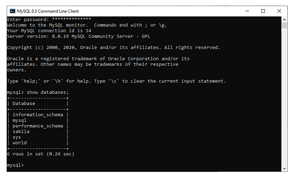

# Dev_Setup
Setup Development Environment

#Assignment: Setting Up Your Developer Environment

#Objective:
This assignment aims to familiarize you with the tools and configurations necessary to set up an efficient developer environment for software engineering projects. Completing this assignment will give you the skills required to set up a robust and productive workspace conducive to coding, debugging, version control, and collaboration.

#Tasks:

1. Select Your Operating System (OS):
   Choose an operating system that best suits your preferences and project requirements. Download and Install Windows 11. https://www.microsoft.com/software-download/windows11

Step 1: System Requirements
   Ensure your system meets the following requirements for Windows 11:
      Processor: 1 gigahertz (GHz) or faster with at least 2 cores on a compatible 64-bit processor or system on a chip (SoC).
      RAM: 4 GB or more.
      Storage: 64 GB or larger storage device.
      System Firmware: UEFI, Secure Boot capable.
      TPM: Trusted Platform Module (TPM) version 2.0.
      Graphics Card: DirectX 12 compatible graphics / WDDM 2.x.
      Display: >9” with HD Resolution (720p).
      Internet Connection: Internet connectivity is necessary to perform updates and to download and take advantage of some features.

Step 2: Backup Your Data
Before proceeding, back up all important data to avoid any potential data loss during the installation process.

Step 3: Download Windows 11
Go to the Official Windows 11 Download Page:
Open your browser and visit the Windows 11 download page.
Download the Installation Media:
You can either download the Windows 11 Installation Assistant or create a bootable USB drive.
For most users, the Installation Assistant is the easiest way to upgrade.

Step 4: Use Windows 11 Installation Assistant
Run the Installation Assistant:
Download and open the Windows 11 Installation Assistant.
Follow the on-screen instructions to start the upgrade process.

Step 5: Create a Bootable USB Drive (if needed)
   Download the Media Creation Tool:
      On the Windows 11 download page, select "Create Windows 11 Installation Media."
      Download and run the Media Creation Tool.
   Create Installation Media:
      Choose the USB drive you want to make bootable (at least 8 GB of space).
      Follow the prompts to create the bootable USB drive.

Step 6: Install Windows 11
   Using the Installation Assistant:
      If you’re using the Installation Assistant, it will guide you through the upgrade process automatically.
   Using the Bootable USB Drive:
      Insert the bootable USB drive into your PC.
      Restart your PC and boot from the USB drive (you might need to adjust the BIOS settings to boot from USB).
      Follow the on-screen instructions to perform a clean installation.

Sep 7: Complete the Installation
   Follow the Setup Process:
      Choose your language, time, and keyboard preferences.
      Click "Install Now."
      Enter your product key (if required).
      Select the edition of Windows 11 you purchased.
      Choose the installation type (Upgrade or Custom).
      Follow the prompts to complete the installation.

   Set Up Windows 11:
      After installation, go through the initial setup process, including setting up your Microsoft account, configuring privacy settings, and personalizing your installation.

Step 8:Install Drivers and Updates
   Check for Updates:
      Go to Settings > Windows Update and check for any available updates.
      Install all recommended updates to ensure you have the latest features and security patches.

   Install Drivers:
      Ensure all hardware drivers are installed and up to date. Check the manufacturer’s website for the latest drivers for your system.

Step 9: Restore Your Data
If you performed a clean installation, restore your backed-up data. 

2. Install a Text Editor or Integrated Development Environment (IDE):
   Select and install a text editor or IDE suitable for your programming languages and workflow. Download and Install Visual Studio Code. https://code.visualstudio.com/Download

Step 1: Download VS Code:
Visit the official Visual Studio Code website: https://code.visualstudio.com/
Click on the "Download" button appropriate for your operating system (Windows, macOS, or Linux).

Step 2: Install VS Code:
   Windows: 
      Once the download completes, run the installer (.exe file) and follow the installation wizard instructions. After installation, you can launch VS Code from the Start menu.
   macOS: 
      Open the downloaded .dmg file, drag Visual Studio Code to the Applications folder, and then launch VS Code like any other application.
   Linux: 
      Depending on your distribution, you can install VS Code using the appropriate package manager (e.g., .deb for Debian/Ubuntu-based distributions or .rpm for Red Hat/Fedora-based distributions). Alternatively, you can download the .tar.gz archive, extract it to a desired location, and run the code binary.

Step 3: Initial Setup:
   Upon launching VS Code for the first time, you may be prompted to install the recommended extensions for popular programming languages and frameworks. You can choose to install these or skip this step and install extensions later as needed.

Step 4: Update Settings and Preferences:
   Customize VS Code by accessing the settings (File > Preferences on Windows/Linux or Code > Preferences on macOS). Here, you can configure various preferences such as themes, keybindings, and extensions.

Step 5: Install Extensions:
   VS Code supports a wide range of extensions that enhance its functionality for different programming languages and development workflows. You can explore and install extensions from the Extensions view (Ctrl+Shift+X or Cmd+Shift+X).

Step 5: Start Coding:
   Once everything is set up, you can start writing and editing code in VS Code. Open a folder or file (File > Open Folder... or File > Open...), and begin coding.

3. Set Up Version Control System:
   Install Git and configure it on your local machine. Create a GitHub account for hosting your repositories. Initialize a Git repository for your project and make your first commit. https://github.com

4. Install Necessary Programming Languages and Runtimes:
  Instal Python from http://wwww.python.org programming language required for your project and install their respective compilers, interpreters, or runtimes. Ensure you have the necessary tools to build and execute your code.

  Installing Python
Download Python Installer:

Go to Python's official website.
Download the latest version of Python that is suitable for your operating system (Windows, macOS, or Linux). Python 3.x is the recommended version unless you have specific reasons to use Python 2.x.
Run the Installer:

Once downloaded, run the installer executable (.exe file on Windows or .pkg file on macOS).
Configure Installation:

During installation, ensure that you check the option "Add Python to PATH" (on Windows) or "Install launcher for all users" and "Add Python to PATH" (on macOS). This step ensures that Python can be run easily from the command line.
Complete the Installation:

Follow the prompts and complete the installation. Python should now be installed on your system.
Verify Python Installation
To verify that Python is installed correctly, open a command prompt (Windows) or terminal (macOS/Linux) and type:

bash
Copy code
python --version
This command should display the installed Python version number, confirming that Python is correctly installed and accessible from the command line.

Installing Necessary Tools
Depending on your project's requirements, you might need additional tools such as package managers (pip for Python), IDEs (Integrated Development Environments), text editors, or specific libraries. Here are some common tools you might consider installing:

pip (Python Package Installer):

pip is typically included with Python installations from version 3.4 onwards. You can verify its installation by running:
bash
Copy code
pip --version
If pip is not installed or you need to upgrade it, instructions can be found on the official pip documentation.
IDEs or Text Editors:

Popular choices include PyCharm, Visual Studio Code, Atom, Sublime Text, etc. Choose one based on your preference and project requirements.
Additional Considerations
Virtual Environments: Consider using virtual environments (venv or virtualenv) to manage dependencies and isolate project environments. This helps avoid conflicts between different projects that might require different versions of libraries.

Setting up Runtimes for Other Languages:

For other programming languages (e.g., Java, C++, JavaScript), you'll need to download and install their respective compilers or runtimes from their official websites or package managers suitable for your operating system.

5. Install Package Managers:
   If applicable, install package managers like pip (Python).

6. Configure a Database (MySQL):
   Download and install MySQL database. https://dev.mysql.com/downloads/windows/installer/5.7.html

                  A. Download MySQL
   Step 1: Go to the official website of MySQL and download the community server edition software. Here, you will see the option to choose the Operating System, such as Windows.

   Step 2: Next, there are two options available to download the setup. Choose the version number for the MySQL community server, which you want. If you have good internet connectivity, then choose the mysql-installer-web-community. Otherwise, choose the other one.

                  B. Installing MySQL on Windows
   Step 1: After downloading the setup, unzip it anywhere and double click the MSI installer .exe file. 

   Step 2: In the next wizard, choose the Setup Type. There are several types available, and you need to choose the appropriate option to install MySQL product and features. Here, we are going to select the Full option and click on the Next button.

      This option will install the following things: MySQL Server, MySQL Shell, MySQL Router, MySQL Workbench, MySQL Connectors, documentation, samples and examples, and many more.

   Step 3: Once we click on the Next button, it may give information about some features that may fail to install on your system due to a lack of requirements. We can resolve them by clicking on the Execute button that will install all requirements automatically or can skip them. Now, click on the Next button.

   Step 4: In the next wizard, we will see a dialog box that asks for our confirmation of a few products not getting installed. Here, we have to click on the Yes button.

      After clicking on the Yes button, we will see the list of the products which are going to be installed. So, if we need all products, click on the Execute button.

   Step 5: Once we click on the Execute button, it will download and install all the products. After completing the installation, click on the Next button.

   Step 6: In the next wizard, we need to configure the MySQL Server and Router. Here, I am not going to configure the Router because there is no need to use it with MySQL. We are going to show you how to configure the server only. Now, click on the Next button.

   Step 7: As soon as you will click on the Next button, you can see the screen below. Here, we have to configure the MySQL Server. Now, choose the Standalone MySQL Server/Classic MySQL Replication option and click on Next. Here, you can also choose the InnoDB Cluster based on your needs

   Step 8: In the next screen, the system will ask you to choose the Config Type and other connectivity options. Here, we are going to select the Config Type as 'Development Machine' and Connectivity as TCP/IP, and Port Number is 3306, then click on Next.

   Step 9: Now, select the Authentication Method and click on Next. Here, I am going to select the first option.

   Step 10: The next screen will ask you to mention the MySQL Root Password. After filling the password details, click on the Next button.

   Step 11: The next screen will ask you to configure the Windows Service to start the server. Keep the default setup and click on the Next button.

   Step 12: In the next wizard, the system will ask you to apply the Server Configuration. If you agree with this configuration, click on the Execute button.

   Step 13: Once the configuration has completed, you will get the screen below. Now, click on the Finish button to continue.

   Step 14: In the next screen, you can see that the Product Configuration is completed. Keep the default setting and click on the Next-> Finish button to complete the MySQL package installation.

   Step 15: In the next wizard, we can choose to configure the Router. So click on Next->Finish and then click the Next button.

   Step 16: In the next wizard, we will see the Connect to Server option. Here, we have to mention the root password, which we had set in the previous steps.

         In this screen, it is also required to check about the connection is successful or not by clicking on the Check button. If the connection is successful, click on the Execute button. Now, the configuration is complete, click on Next.

   Step 17: In the next wizard, select the applied configurations and click on the Execute button.

   Step 18: After completing the above step, we will get the following screen. Here, click on the Finish button.

   Step 19: Now, the MySQL installation is complete. Click on the Finish button.

                     C. Verify MySQL installation

Once MySQL has been successfully installed, the base tables have been initialized, and the server has been started, you can verify its working via some simple tests.

Open your MySQL Command Line Client; it should have appeared with a mysql> prompt. If you have set any password, write your password here. Now, you are connected to the MySQL server, and you can execute all the SQL command at mysql> prompt as follows:

For example: Check the already created databases with show databases command:

7. Set Up Development Environments and Virtualization (Optional):
   Consider using virtualization tools like Docker or virtual machines to isolate project dependencies and ensure consistent environments across different machines.

1. Using Docker
Docker is a popular containerization platform that packages applications and their dependencies into containers. These containers can run on any system that has Docker installed, ensuring consistent environments across different machines.

Installing Docker
Windows and macOS: Download and install Docker Desktop from the Docker website.
Linux: Install Docker using your package manager. For example, on Ubuntu:
sh
Copy code
sudo apt-get update
sudo apt-get install -y docker.io
sudo systemctl start docker
sudo systemctl enable docker
Creating a Dockerfile
A Dockerfile is a script that contains instructions for building a Docker image.

Example Dockerfile for a Python project:

Dockerfile
Copy code
# Use an official Python runtime as a parent image
FROM python:3.9-slim

# Set the working directory in the container
WORKDIR /app

# Copy the current directory contents into the container at /app
COPY . /app

# Install any needed packages specified in requirements.txt
RUN pip install --no-cache-dir -r requirements.txt

# Make port 80 available to the world outside this container
EXPOSE 80

# Define environment variable
ENV NAME World

# Run app.py when the container launches
CMD ["python", "app.py"]
Building and Running the Docker Container
Build the Docker image:
sh
Copy code
docker build -t my-python-app .
Run the Docker container:
sh
Copy code
docker run -p 4000:80 my-python-app

2. Using Virtual Machines
Virtual machines (VMs) offer a more isolated environment compared to containers but can be more resource-intensive.

Using Vagrant
Vagrant is a tool for building and managing VMs. It provides easy-to-configure, reproducible, and portable work environments.

Installing Vagrant
Install Vagrant: Download and install Vagrant from the Vagrant website.
Install VirtualBox: Download and install VirtualBox from the VirtualBox website.
Creating a Vagrantfile
A Vagrantfile is a configuration file for Vagrant.

Example Vagrantfile for an Ubuntu VM:

ruby
Copy code
# Vagrantfile API/syntax version. Don't touch unless you know what you're doing!
VAGRANTFILE_API_VERSION = "2"

Vagrant.configure(VAGRANTFILE_API_VERSION) do |config|
  # All Vagrant configuration is done here

  # The most common configuration options are documented and commented below.
  # For a complete reference, please see the online documentation at
  # https://docs.vagrantup.com.

  # Every Vagrant development environment requires a box. You can search for
  # boxes at https://vagrantcloud.com/search.
  config.vm.box = "ubuntu/bionic64"

  # Disable automatic box update checking. If you disable this, then boxes will
  # only be checked for updates when the user runs `vagrant box outdated`. This
  # is not recommended.
  # config.vm.box_check_update = false

  # Create a forwarded port mapping which allows access to a specific port
  # within the machine from a port on the host machine. In the example below,
  # accessing "localhost:8080" will access port 80 on the guest machine.
  config.vm.network "forwarded_port", guest: 80, host: 8080

  # Create a private network, which allows host-only access to the machine
  # using a specific IP.
  config.vm.network "private_network", ip: "192.168.33.10"

  # Create a public network, which generally matched to bridged network.
  # Bridged networks make the machine appear as another physical device on
  # your network.
  # config.vm.network "public_network"

  # Share an additional folder to the guest VM. The first argument is the path
  # on the host to the actual folder. The second argument is the path on the
  # guest to mount the folder. And the optional third argument is a set of
  # non-required options.
  config.vm.synced_folder "../data", "/vagrant_data"

  # Provider-specific configuration so you can fine-tune various
  # backing providers for Vagrant. These expose provider-specific options.
  # Example for VirtualBox:
  #
  # config.vm.provider "virtualbox" do |vb|
  #   # Display the VirtualBox GUI when booting the machine
  #   vb.gui = true
  #
  #   # Customize the amount of memory on the VM:
  #   vb.memory = "1024"
  # end

  # Enable provisioning with a shell script. Additional provisioners such as
  # Puppet, Chef, Ansible, Salt, and Docker are also available. Please see the
  # documentation for more information about their specific syntax and use.
  config.vm.provision "shell", inline: <<-SHELL
    apt-get update
    apt-get install -y apache2
  SHELL
end
Starting the VM

Initialize Vagrant:
sh
Copy code
vagrant init
Start the VM:
sh
Copy code
vagrant up

3. Choosing Between Docker and Virtual Machines
Docker is generally preferred for microservices, quick development iterations, and when you need to ensure consistency across different environments. It's lightweight and faster to start up.
Virtual Machines provide a full OS environment and are useful when you need to simulate a complete machine or run different OSes that might have specific requirements.

8. Explore Extensions and Plugins:
   Explore available extensions, plugins, and add-ons for your chosen text editor or IDE to enhance functionality, such as syntax highlighting, linting, code formatting, and version control integration.

            Visual Studio Code (VS Code)
ESLint: Linting for JavaScript and TypeScript.
Prettier: Code formatter for various languages.
GitLens: Git integration with advanced features.
Live Share: Collaborative editing and debugging.
Debugger for Chrome: Debug JavaScript in the Chrome browser.
Python (or any language) extension: Language-specific support with IntelliSense.

            Sublime Text
Package Control: Manages plugins and extensions.
Emmet: HTML/CSS abbreviation tool.
SublimeLinter: Code linting framework.
Git: Git integration.
BracketHighlighter: Enhanced bracket matching.

            Atom
Language-specific Packages: For syntax highlighting and IntelliSense.
Linter: General purpose code linting.
Atom Beautify: Code formatter.
PlatformIO IDE Terminal: Integrated terminal.
Git Integration: Basic Git support.

            IntelliJ IDEA / JetBrains IDEs (e.g., PyCharm, WebStorm)
Version Control (e.g., Git): Built-in Git support.
Code Inspections: Integrated linting and code analysis.
Database Tools and SQL: Database integration.
Markdown Support: Preview and editing.
Plugin Ecosystem: Extensive library for various functionalities.

            Emacs
Emacs Package Manager (ELPA/MELPA): Extensive package repositories.
Magit: Git integration.
Flycheck: On-the-fly syntax checking/linting.
YASnippet: Template system.
Org Mode: Note-taking and organizing.

            Vim
Vundle/Vim-Plug: Plugin managers.
NERDTree: File system explorer.
YouCompleteMe: Code completion engine.
Syntastic: Syntax checking/linting.
Fugitive: Git integration.

9. Document Your Setup:
    Create a comprehensive document outlining the steps you've taken to set up your developer environment. Include any configurations, customizations, or troubleshooting steps encountered during the process. 

Developer Environment Setup Documentation

1. Operating System and Tools
Operating System: Ubuntu 20.04 LTS
Terminal: GNOME Terminal
Text Editor: Visual Studio Code (VS Code)
Version Control: Git

2. Installing Essential Software
2.1. Ubuntu Packages
Update Repositories:
sql
Copy code
sudo apt update
Install Essential Tools:
Copy code
sudo apt install build-essential curl wget git
2.2. Visual Studio Code
Download:
Downloaded .deb package from VS Code website.
Installation:
css
Copy code
sudo dpkg -i <package_name>.deb
sudo apt install -f
Extensions Installed:
Python, Docker, GitLens, ESLint, Prettier, Live Server
2.3. Git Configuration
Setup:
arduino
Copy code
git config --global user.name "Your Name"
git config --global user.email "you@example.com"
SSH Key:
Generated SSH key and added to GitHub account.

3. Setting Up Development Environment
3.1. Python Development
Python Version: Installed Python 3.8 using pyenv.
Virtual Environment:
bash
Copy code
python -m venv env
source env/bin/activate
Packages Installed: pip install numpy pandas matplotlib
3.2. Node.js Development
Node Version Manager (nvm): Installed and set default Node.js version.
Global Packages:
Copy code
npm install -g eslint nodemon
3.3. Docker
Installation: Followed Docker's official installation guide for Ubuntu.
3.4. Database
PostgreSQL: Installed and configured with psql.

4. Custom Configurations
4.1. Shell Customizations
.bashrc: Added aliases and environment variables.
bash
Copy code
alias ll='ls -alF'
export PATH="$PATH:/path/to/custom/bin"
4.2. VS Code Settings
Settings.json:
json
Copy code
{
    "editor.fontSize": 14,
    "editor.tabSize": 2,
    "python.pythonPath": "env/bin/python",
    "eslint.enable": true,
    "files.autoSave": "onWindowChange"
}

5. Troubleshooting
5.1. Issues Encountered
Git SSH: Had to regenerate SSH keys due to permissions issue.
VS Code Extensions: Occasionally had to disable conflicting extensions.

#Deliverables:
- Document detailing the setup process with step-by-step instructions and screenshots where necessary.
- A GitHub repository containing a sample project initialized with Git and any necessary configuration files (e.g., .gitignore).
- A reflection on the challenges faced during setup and strategies employed to overcome them.

#Submission:
Submit your document and GitHub repository link through the designated platform or email to the instructor by the specified deadline.

#Evaluation Criteria:**
- Completeness and accuracy of setup documentation.
- Effectiveness of version control implementation.
- Appropriateness of tools selected for the project requirements.
- Clarity of reflection on challenges and solutions encountered.
- Adherence to submission guidelines and deadlines.

Note: Feel free to reach out for clarification or assistance with any aspect of the assignment.
